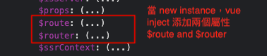

# hi-router
分析和解析 `vue-router`，為主要學習目的，並且實現簡易 `vue-router` 名為 `hi-router`

## Project setup
```
npm install
```

### Compiles and hot-reloads for development
```
npm run serve
```

### Compiles and minifies for production
```
npm run build
```

### Lints and fixes files
```
npm run lint
```

## 步驟
1. 參考 code 裡註解 (`src/main.js`)

`route` 是您定義的**路由規則**，router 是 `new VueRouter` create instance。